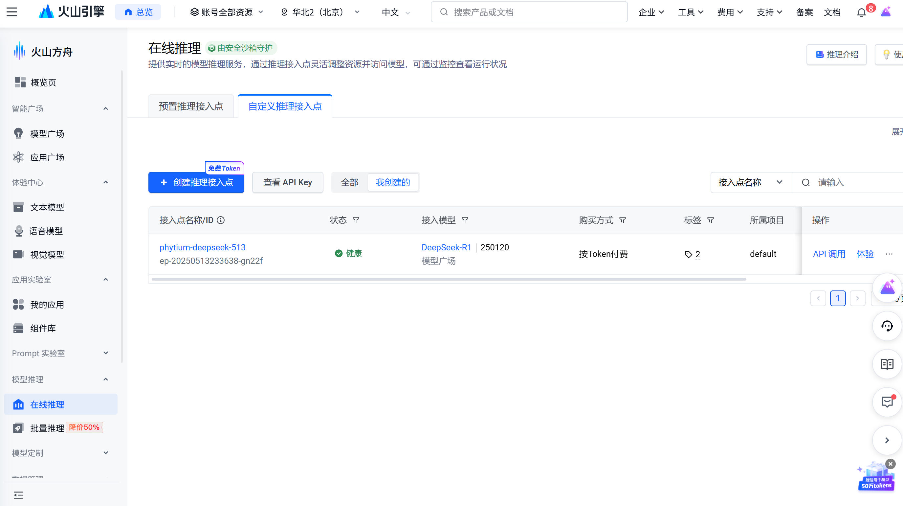
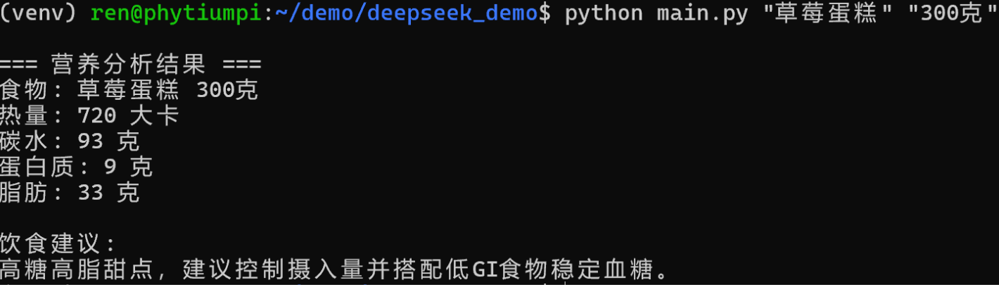
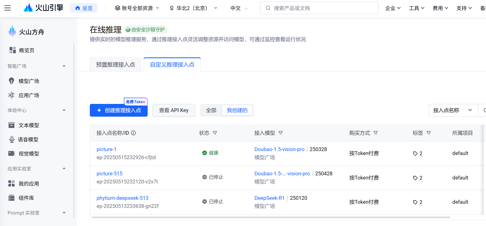
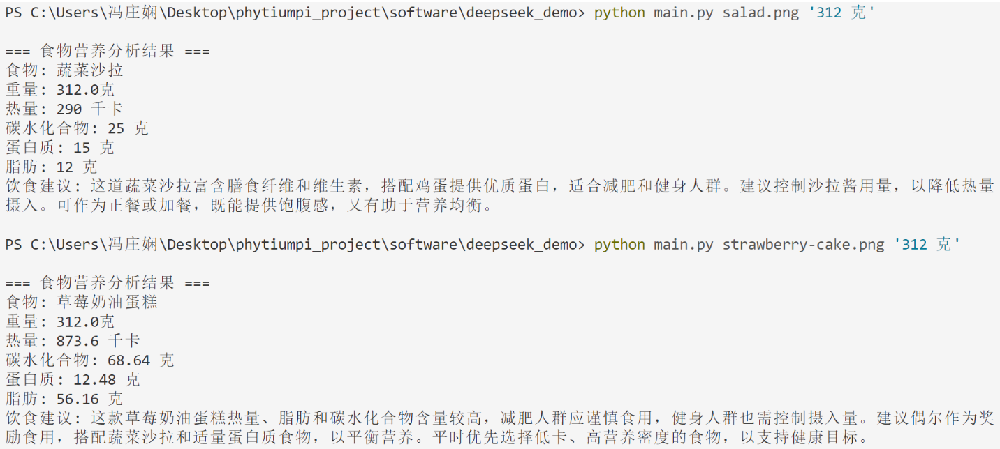

# 远程大语言模型接入

## 大模型根据食物名称和重量预测热量

**（该需求已弃用，请看后文变更后的需求）**

需求：程序输入为食物名称和重量，输出热量及营养成分预估和饮食建议。

实现方案：把食物名称和重量镶嵌进提示词内，调用API发给远程大语言模型，规范大语言模型的返回格式，然后解析并输出。

### 申请API

在字节的火山引擎申请API并接入deepseek-r1



### 写代码

注意修改url，api-key和模型名称

```
url：https://ark.cn-beijing.volces.com/api/v3/chat/completions
api-key：保密
模型名称：deepseek-r1-250120
```

main.py

```python
import argparse
import requests
import json
from typing import Dict, Optional

def load_prompt_template() -> str:
    """加载提示词模板（增加文件检查）"""
    try:
        with open("prompt_template.txt", "r", encoding="utf-8") as f:
            content = f.read().strip()
            return content
    except FileNotFoundError:
        print("\n=== 错误：未找到 prompt_template.txt ===")
        exit(1)

def call_deepseek_api(prompt: str, api_key: str) -> Optional[Dict]:
    """调用 DeepSeek API"""
    url = "https://ark.cn-beijing.volces.com/api/v3/chat/completions"  # 替换为火山引擎提供的API地址
    headers = {
        "Content-Type": "application/json",
        "Authorization": f"Bearer {api_key}"
    }
    data = {
        "model": "deepseek-r1-250120",  # 根据实际模型名称调整
        "messages": [{"role": "user", "content": prompt}],
        "temperature": 0.7,
        "max_tokens": 500
    }

    try:
        response = requests.post(url, headers=headers, json=data)
        response.raise_for_status()  # 检查HTTP错误
        return response.json()
    except requests.exceptions.RequestException as e:
        print(f"API请求失败: {e}")
        print(f"\n=== 调试：API请求失败 ===")  # 调试信息
        print(f"Error: {e}")
        return None

def parse_nutrition_response(api_response: Dict) -> Optional[Dict]:
    if not api_response:
        print("\n=== 调试：API响应为空 ===")
        return None
    """解析API返回的营养数据"""
    try:
        content = api_response["choices"][0]["message"]["content"]
        return json.loads(content)  # 假设API返回的是JSON字符串
    except (KeyError, json.JSONDecodeError) as e:
        print(f"解析API响应失败: {e}")
        return None

def main():
    # 1. 解析命令行参数
    parser = argparse.ArgumentParser(description="食物营养分析工具（基于DeepSeek API）")
    parser.add_argument("food", type=str, help="食物名称（中文，如 '草莓蛋糕'）")
    parser.add_argument("weight", type=str, help="重量（如 '300克'）")
    args = parser.parse_args()

    # 2. 加载提示词模板
    template = load_prompt_template()
    prompt = template.format(food=args.food, weight=args.weight)

    # 3. 调用DeepSeek API（API_KEY需替换为你的实际密钥）
    API_KEY = "保密"  # 建议改用环境变量或配置文件
    api_response = call_deepseek_api(prompt, API_KEY)

    if not api_response:
        print("API请求失败，请检查网络或API密钥。")
        return

    # 4. 解析并打印结果
    nutrition_data = parse_nutrition_response(api_response)
    if nutrition_data:
        print("\n=== 营养分析结果 ===")
        print(f"食物: {args.food} {args.weight}")
        print(f"热量: {nutrition_data.get('calories', 'N/A')} 大卡")
        print(f"碳水: {nutrition_data.get('carbohydrates', 'N/A')} 克")
        print(f"蛋白质: {nutrition_data.get('protein', 'N/A')} 克")
        print(f"脂肪: {nutrition_data.get('fat', 'N/A')} 克")
        print("\n饮食建议:")
        print(nutrition_data.get("advice", "N/A"))
    else:
        print("解析营养数据失败，请检查API返回格式。")

if __name__ == "__main__":
    main()
```

### 提示词模版

prompt_template.txt

```txt
请根据以下食物和重量，返回JSON格式的营养数据，包含热量（大卡）、碳水化合物（克）、蛋白质（克）、脂肪（克）及简短的饮食建议。示例输出格式：
{{
    "calories": 250,
    "carbohydrates": 30,
    "protein": 5,
    "fat": 10,
    "advice": "适量食用，建议搭配蛋白质食物平衡营养。"
}}

食物：{food}，重量：{weight}。请仅返回JSON数据，不要额外解释。
```

### 测试




## 需求变更：直接让大模型图像识别

需求变更：程序输入为图像路径和重量，输出营养成分预估和饮食建议。

实现方案：把重量镶嵌进提示词内，调用API将提示词和图像的base64编码发给远程大语言模型，规范大语言模型的返回格式，然后解析并输出。

### 申请API



采用Doubao-1.5-vision-pro大模型，也试了一下中间那个带深度思考的，效果更好，但响应很慢

### 写代码

main.py代码：与之前的差不多，不同的是需要处理图片，将图片转成base64编码发送

代码在本目录中，修改api-key即可

```python
import argparse
import requests
import json
import os
from typing import Dict, Optional, Tuple
from urllib.parse import urlparse
import base64

# 硬编码API密钥
DEEPSEEK_API_KEY = "保密"  

def load_prompt_template() -> str:
    """加载提示词模板（增加文件检查）"""
    try:
        with open("prompt_template.txt", "r", encoding="utf-8") as f:
            content = f.read().strip()
            return content
    except FileNotFoundError:
        print("\n=== 错误：未找到 prompt_template.txt ===")
        exit(1)

def encode_image_to_base64(image_path: str) -> Optional[str]:
    """
    将本地图片编码为Base64字符串。

    :param image_path: 本地图片路径
    :return: Base64编码的图片字符串或None
    """
    try:
        with open(image_path, "rb") as image_file:
            encoded_string = base64.b64encode(image_file.read()).decode('utf-8')
        return encoded_string
    except Exception as e:
        print(f"图片编码失败: {e}")
        return None

def call_deepseek_api(prompt_content: str, image_base64: str) -> Optional[Dict]:
    """调用doubao Vision API"""
    url = "https://ark.cn-beijing.volces.com/api/v3/chat/completions"
    headers = {
        "Content-Type": "application/json",
        "Authorization": f"Bearer {DEEPSEEK_API_KEY}"
    }

    # 构建消息内容
    messages = [
        {
            "content": [
                {"text": prompt_content, "type": "text"},
                {
                    "image_url": {
                        "url": f"data:image/png;base64,{image_base64}"
                    },
                    "type": "image_url"
                }
            ],
            "role": "user"
        }
    ]

    # 根据API文档调整请求体
    # 如果API需要不同的格式，请参考API文档进行调整
    payload = {
        "model": "ep-20250515232926-cfjtd",
        "messages": messages
    }

    try:
        response = requests.post(
            url,
            headers=headers,
            json=payload
        )
        response.raise_for_status()
        return response.json()
    except requests.exceptions.RequestException as e:
        print(f"API请求失败: {e}")
        return None
    except Exception as e:
        print(f"请求处理异常: {e}")
        return None

def parse_nutrition_response(api_response: Dict) -> Optional[Dict]:
    """解析API返回的营养数据"""
    if not api_response:
        print("\n=== 调试：API响应为空 ===")
        return None

    try:
        # 假设API返回的内容在choices[0].message.content中，并且是JSON字符串
        content = api_response["choices"][0]["message"]["content"]
        
        # 尝试直接解析内容为JSON（如果API返回的是JSON字符串）
        try:
            return json.loads(content)
        except json.JSONDecodeError:
            # 如果不是JSON字符串，则需要从文本中提取
            print("API返回的内容不是有效的JSON字符串，尝试解析文本...")
            # 示例：假设响应包含类似 "热量: 250千卡, 碳水化合物: 30克, ..."
            # 这里需要根据实际响应进行正则匹配或其他解析方法
            # 由于不确定具体格式，这里返回原始内容
            return {"raw_response": content}
    except (KeyError, json.JSONDecodeError) as e:
        print(f"解析API响应失败: {e}")
        print(f"原始响应: {api_response}")
        return None

def validate_weight(weight_str: str) -> Tuple[bool, float]:
    """
    验证并解析重量字符串（如"300克"）
    :param weight_str: 重量字符串
    :return: (是否有效, 重量值)
    """
    try:
        # 提取数字和单位
        parts = weight_str.strip().split()
        if len(parts) != 2:
            raise ValueError("重量格式不正确，应为'数字 单位'（如'300 克'）")

        value = float(parts[0])
        unit = parts[1].strip().lower()

        # 检查单位是否合法
        if unit not in ["克", "g", "千克", "kg"]:
            raise ValueError(f"不支持的单位: {unit}，仅支持'克'、'g'、'千克'、'kg'")

        # 统一转换为克
        if unit in ["千克", "kg"]:
            value *= 1000

        return True, value
    except ValueError as e:
        print(f"重量解析失败: {e}")
        return False, 0

def main():
    # 1. 解析命令行参数
    parser = argparse.ArgumentParser(description="食物营养分析工具（基于图片和重量）")
    parser.add_argument("image_path", type=str, help="食物图片的本地路径")
    parser.add_argument("weight", type=str, help="重量（如 '300克'）")
    args = parser.parse_args()

    # 2. 验证重量格式
    is_valid, weight_grams = validate_weight(args.weight)
    if not is_valid:
        print("\n=== 错误：重量格式无效 ===")
        print("请使用格式如 '300 克' 或 '1.5 kg'")
        exit(1)

    # 3. 检查图片文件是否存在
    if not os.path.isfile(args.image_path):
        print(f"\n=== 错误：图片文件不存在 ===")
        print(f"路径: {args.image_path}")
        exit(1)

    # 4. 加载提示词模板
    template = load_prompt_template()
    food_name = os.path.splitext(os.path.basename(args.image_path))[0]  # 获取文件名（不含扩展名）
    prompt = template.format(food=food_name, weight=f"{weight_grams}克")

    # 5. 将图片编码为Base64
    image_base64 = encode_image_to_base64(args.image_path)
    if not image_base64:
        print("\n=== 错误：无法将图片编码为Base64 ===")
        exit(1)

    # 6. 调用 API
    api_response = call_deepseek_api(prompt, image_base64)

    if not api_response:
        print("API请求失败，请检查网络或API密钥。")
        exit(1)

    # 7. 解析并打印结果
    nutrition_data = parse_nutrition_response(api_response)
    if isinstance(nutrition_data, dict):
        if "calories" in nutrition_data and "carbohydrates" in nutrition_data and \
           "protein" in nutrition_data and "fat" in nutrition_data and "advice" in nutrition_data:
            # 如果API直接返回了完整的营养数据
            result = nutrition_data
        else:
            # 如果API返回的数据不完整，尝试从raw_response中提取（需要自定义解析逻辑）
            # 这里假设返回的raw_response包含类似JSON的字符串
            raw_response = nutrition_data.get("raw_response", "{}")
            try:
                extracted_data = json.loads(raw_response)
                # 根据实际返回的数据结构进行调整
                result = {
                    "calories": extracted_data.get("calories", "N/A"),
                    "carbohydrates": extracted_data.get("carbohydrates", "N/A"),
                    "protein": extracted_data.get("protein", "N/A"),
                    "fat": extracted_data.get("fat", "N/A"),
                    "advice": extracted_data.get("advice", "N/A"),
                    "food": extracted_data.get("food", "N/A")
                }
            except json.JSONDecodeError:
                # 如果无法解析，则返回默认值
                result = {
                    "calories": "N/A",
                    "carbohydrates": "N/A",
                    "protein": "N/A",
                    "fat": "N/A",
                    "advice": "无法解析营养数据",
                    "food": "无法识别"
                }
    else:
        # 如果parse_nutrition_response返回的不是字典，则使用默认值
        result = {
            "calories": "N/A",
            "carbohydrates": "N/A",
            "protein": "N/A",
            "fat": "N/A",
            "advice": "无法解析营养数据",
            "food": "草莓蛋糕"
        }

    # 规范化输出格式
    output = {
        "food": result.get("food", "未知食物"),
        "weight": f"{weight_grams}克",
        "calories": result.get("calories", "N/A"),
        "carbohydrates": result.get("carbohydrates", "N/A"),
        "protein": result.get("protein", "N/A"),
        "fat": result.get("fat", "N/A"),
        "advice": result.get("advice", "N/A")
    }

    # 打印输出
    print("\n=== 食物营养分析结果 ===")
    print(f"食物: {output['food']}")
    print(f"重量: {output['weight']}")
    print(f"热量: {output['calories']} 千卡")
    print(f"碳水化合物: {output['carbohydrates']} 克")
    print(f"蛋白质: {output['protein']} 克")
    print(f"脂肪: {output['fat']} 克")
    print(f"饮食建议: {output['advice']}\n")

if __name__ == "__main__":
    main()
```

### 提示词模版

prompt_template.txt

```
分析这张图片中的食物，已知该食物的重量为{weight}。请预估图片中食物的以下信息：
1. 热量（千卡）
2. 碳水化合物（克）
3. 蛋白质（克）
4. 脂肪（克）
5. 食物名称

并给出大约200字的饮食建议（如是否适合减肥、健身等人群）。
请必须以以下JSON格式返回结果，饮食建议大约200字，绝对不允许其他任何格式：
{{
    "calories": 250,
    "carbohydrates": 30,
    "protein": 5,
    "fat": 10,
    "advice": "适量食用，建议搭配蛋白质食物平衡营养。",
    "food": "草莓蛋糕"
}}
```

### 测试




